# pepper-best-deals


# Pepper Best Deals

## Introduction

This django web application scrapes information from www.pepper.pl. Pepper is a site where any user can post a price bargain. Other users rate whether the promotion is good or not. 
The purpose of the application is to collect informations about all deals (articles), appearing on the site and search historical values. Based on the scraped data, it will be possible to create a data warehouse.

## List of functionalities
1) Scraping new articles and adding them to the database. - "Scrap New Articles"
2) Searching (and scraping) selected articles that have ever appeared. Allows the user to narrow down the results according to the set parameters. - "Search Articles"
3) Continuous scraping of all articles from newest to oldest. This will retrieve all articles that are available on the site. - "Scrape/Scrape all pages"
4) Continuous refreshing of "new" category. This will ensure that newly added articles are immediately populate the database. The feature will also allow user requests to be handled. - "Scrape/Keep refreshing"
5) An email notification system that notifies the user when an item appears at the desired price. - "Request Price Alert"
6) Visualizing the price changes of the searched item on a chart. Allows the user to narrow down the results according to the set parameters. - "Data Analysis"
7) A system for creating a user account with password recovery through a form sent via email.


## For future work
1) Refactoring and simplifying functions.
2) More tests.

## App overview

*Sample images showing the functionalities of the web application*


Home page view
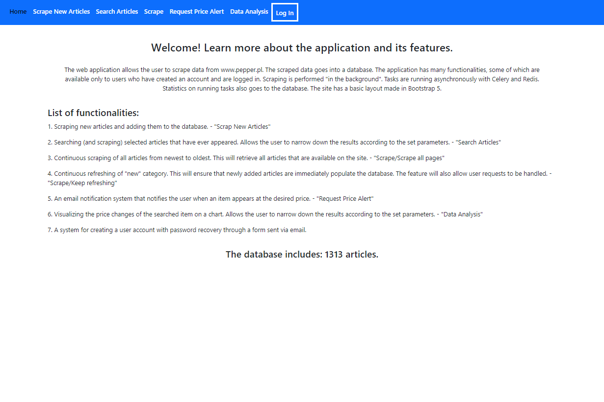

Scraping new articles


Scraping new articles results
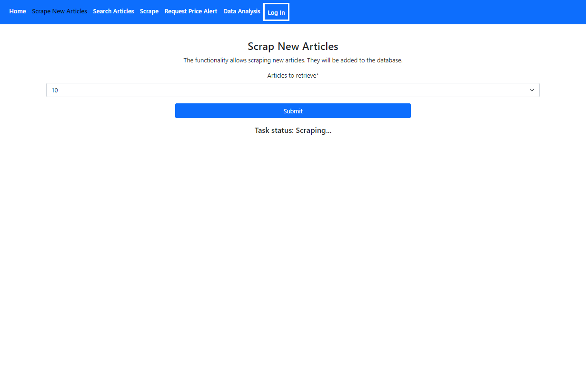

Searching articles
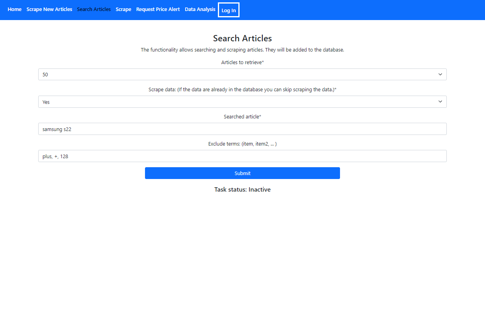

Searching articles results
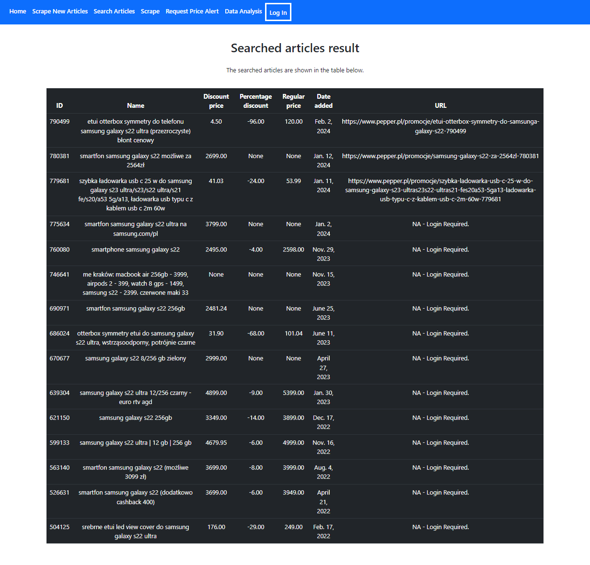

Scraping all articles/refreshing page
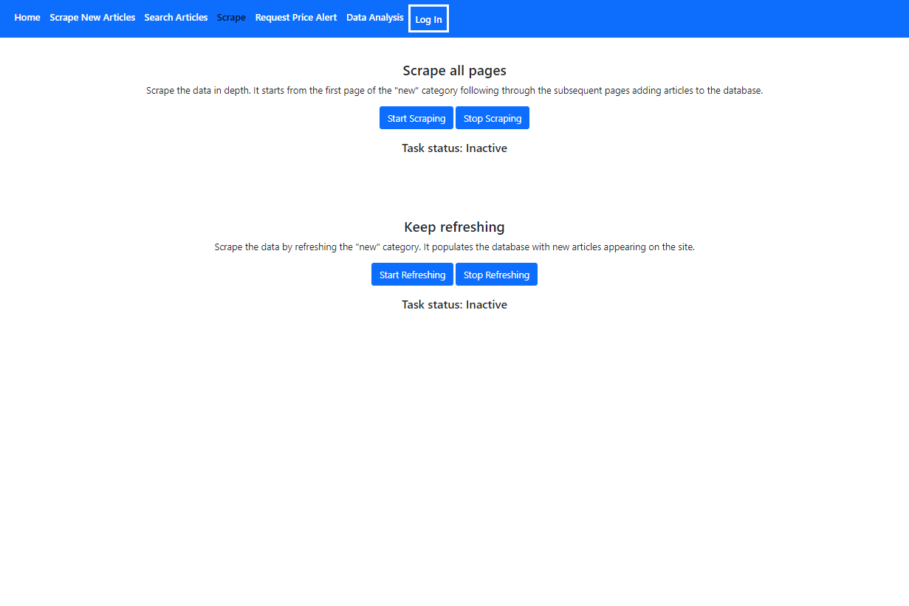

Requesting price alert - when the user is not logged in
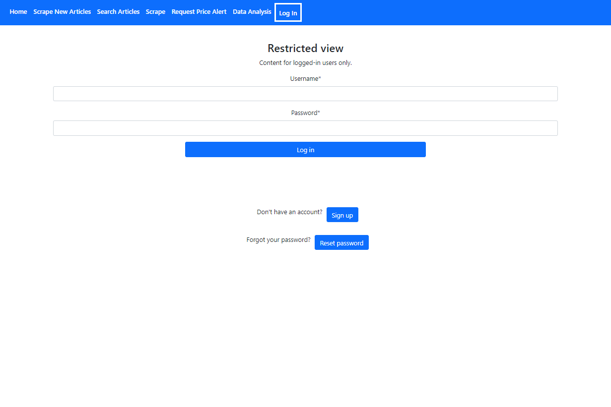

Requesting price alert
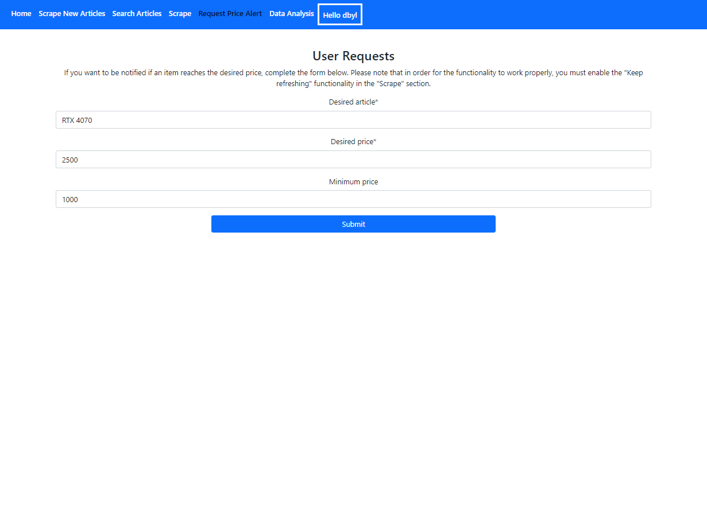

Requesting price alert - email notification
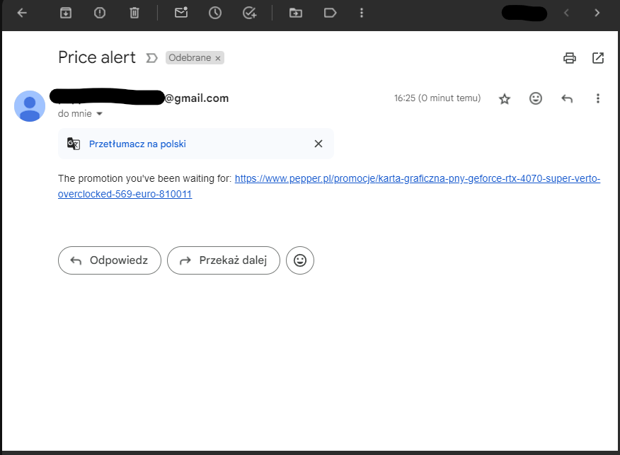

Data visualization
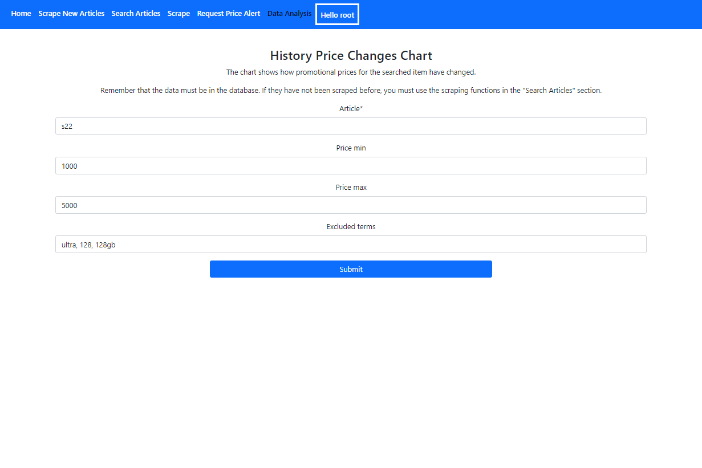

Data visualization results
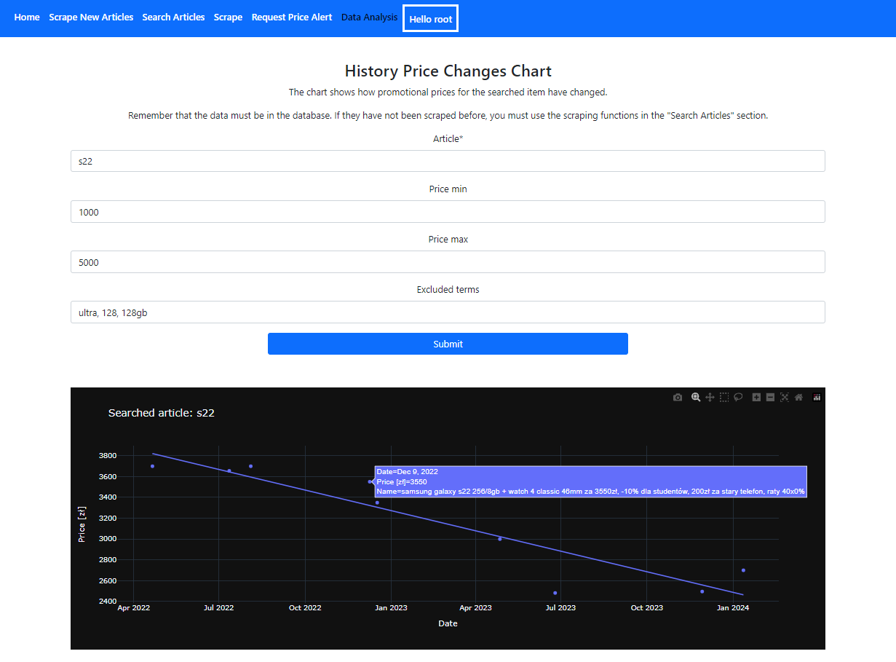

Login view
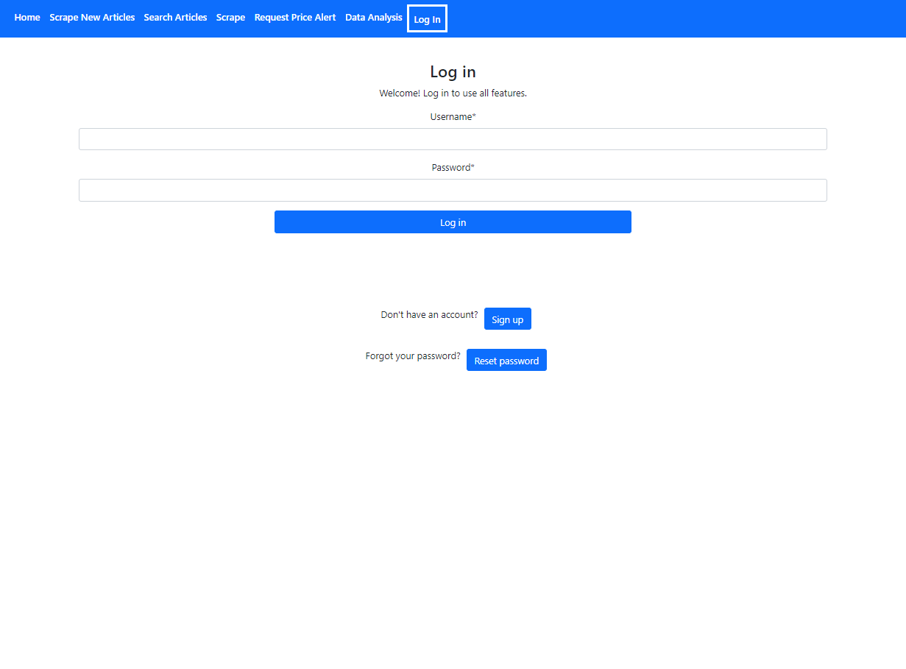

Reseting password
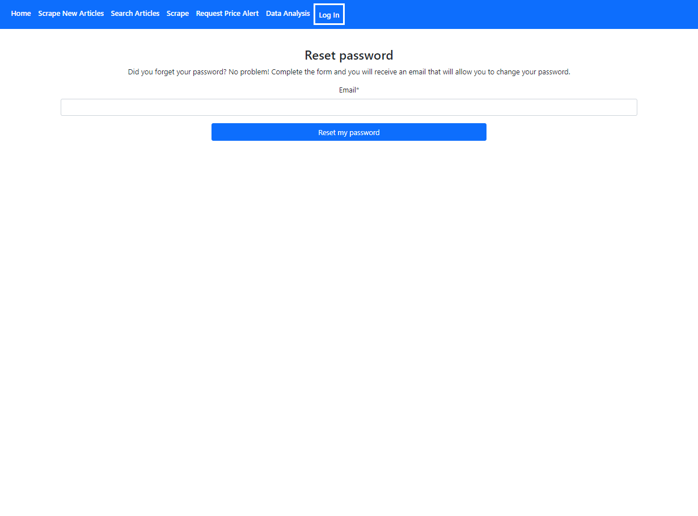

Reseting password - email
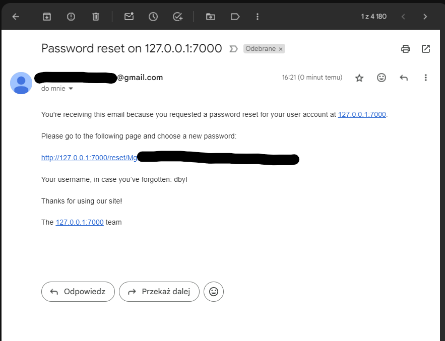

Reseting password - form
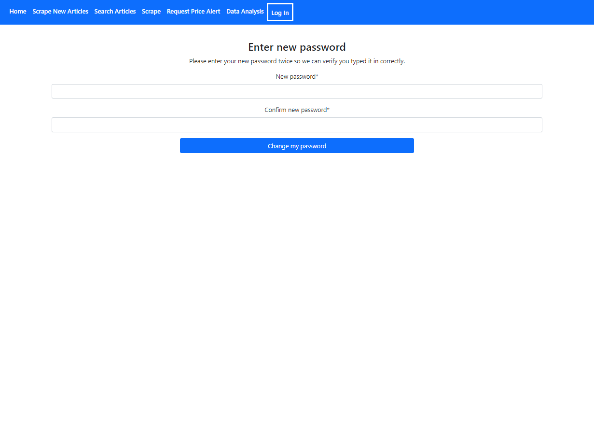


## App Setup
The first thing to do is to clone the repository:

```sh
$ git clone https://github.com/dbyl/pepper-best-deals
$ cd pepper-best-deals
```

This project requires Python 3.9 or later.

Create a virtual environment to install dependencies in and activate it:

Linux:
```sh
$ python3 -m venv env
$ source env/bin/activate
```

Create a .env file in project root directory (source). The file format can be understood from the example below:
```sh
DEBUG=True
SECRET_KEY=your-secret-key #generate your own secret key
URL=https://www.pepper.pl/
POSTGRES_DB_ENGINE=django.db.backends.postgresql
POSTGRES_DB_NAME=your-postgres-name #generate your own postgres name
POSTGRES_USER=your-postgres-user #generate your own postgres user
POSTGRES_PASSWORD=your-postgres-password #generate your own postgres password
POSTGRES_HOST=host.docker.internal #change to localhost for running locally
ALLOWED_HOSTS=0.0.0.0,postgres,127.0.0.1,localhost,127.0.0.0
CELERY_BROKER_URL=redis://redis:6379 #change redis to localhost for running locally
CELERY_RESULT_BACKEND=redis://redis:6379
CELERY_ACCEPT_CONTENT=json
CELERY_TASK_SERIALIZER=json
CELERY_RESULT_SERIALIZER=json
CELERY_IGNORE_RESULT=False
CELERY_TRACK_STARTED=True
SELENIUM_CONTAINTER_NAME=selenium-hub
EMAIL=your-email #enter a mailbox address to handle password reset and notifications
EMAIL_PASSWORD=your-email-password #enter a mailbox password
```

Application runs on docker so docker must be configured *(sudo apt-get install docker-ce docker-ce-cli containerd.io docker-compose-plugin)* and Docker Desktop must be installed.
Please open Docker Desktop and run docker-compose to install dependiences and run application:
```sh
(env)$ docker-compose -f docker-compose.yaml up --build
```

Docker-server should be started.

If project is setting up for the first time make sure that in source/pepper_app/migrations exists only one file - __init__.py.
To make migrations and create superuser open new terminal window and run:
```sh
(env)$ docker exec -it pepper_app /bin/bash
(env)$ python3 manage.py migrate
(env)$ python3 manage.py makemigrations
(env)$ python3 manage.py sqlmigrate pepper_app 0001
(env)$ python3 manage.py createsuperuser
(env)$ python3 manage.py migrate
```

To run tests run:
```sh
(env)$ python3 -m pytest source
```

